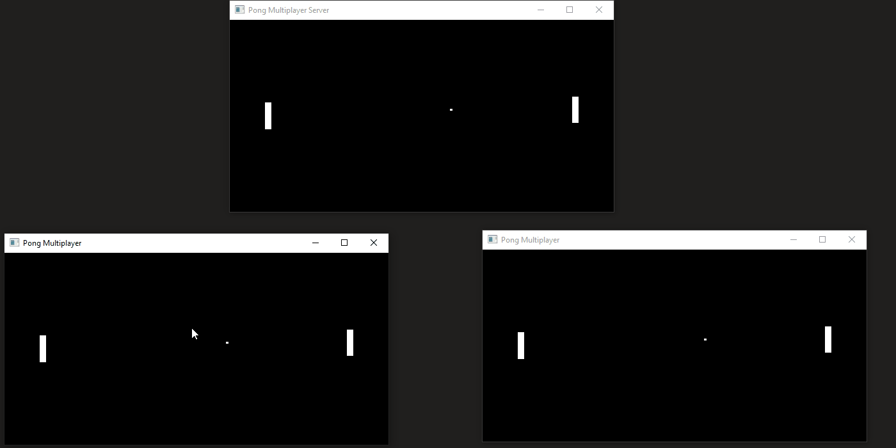

# Pong Multiplayer
Client for a simple Pong game made with Windows' sockets and OpenGL.  
Repository for a server can be found [here](https://github.com/Mikulej/PongMultiplayerServer)  
  

# Requirements
- Windows
- g++

Thoughts:  
Next time use z-buffer for depth  
.dll hell  
Bare sockets are not reliable, data order may change on receiving end  
Next time use one repository for client and server  